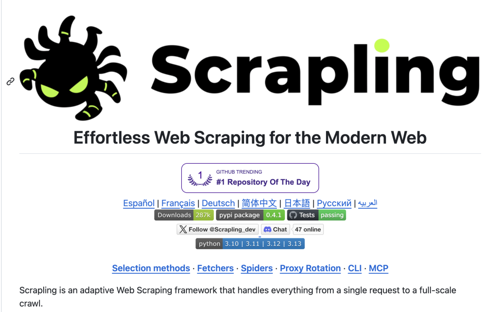
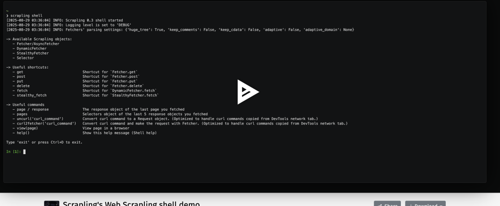

# OpenClaw 最强 Skill：让 AI 自动爬完整个互联网

> 原文链接: https://mp.weixin.qq.com/s/6cDU1suy6q1bzDHbQ6r7QQ
> 图片状态: 已本地化 (assets/)

---

做 AI Agent 的人，迟早会遇到一个问题。

AI 很聪明，但它什么都看不见。

它不会主动打开网站，也不会自己抓数据。  
绝大多数 Agent 的信息来源只有三种：

1 搜索 API  
2 手动输入  
3 固定数据源

而互联网真正有价值的数据，大多数都没有 API。

产品信息  
论坛讨论  
技术文档  
新闻内容  
行业报告

这些数据只存在于网页里。

所以 AI Agent 最大的能力瓶颈，其实不是模型，而是**数据入口** 。

最近我给 OpenClaw 加了一个 Skill，这个问题基本解决了。

AI 现在可以：

自己打开网站  
抓取网页  
解析数据  
生成分析

甚至可以绕过 Cloudflare 等反爬机制。

核心组件只有一个：

Scrapling。

  

* * *

# 一、Scrapling 是什么

Scrapling 是一个专门为现代反爬环境设计的 Python 爬虫框架。

它解决了传统爬虫三个最头疼的问题：

1 网站改版导致选择器失效  
2 Cloudflare 等反爬机制  
3 动态页面抓取困难

很多爬虫项目需要组合：

requests  
playwright  
selenium  
beautifulsoup

Scrapling 直接做成了一套统一能力。

  

核心设计很简单：

**把爬虫分成三层能力。**

* * *

#  二、三种抓取模式

Scrapling 内置三种 Fetcher。

## 1 普通抓取

适合普通网页。
    
    
    from scrapling.fetchers import Fetcher  
      
    page = Fetcher.fetch("https://example.com")  
      
    title = page.css("title::text")  
    print(title)

语法和 parsel、scrapy 非常接近。

* * *

## 2 动态页面抓取

针对 JS 渲染的网站。
    
    
    from scrapling.fetchers import DynamicFetcher  
      
    page = DynamicFetcher.fetch(  
        "https://example.com",  
        headless=True  
    )

本质是浏览器驱动。

但已经封装好了。

* * *

## 3 反反爬抓取

这是 Scrapling 最强的能力。
    
    
    from scrapling.fetchers import StealthyFetcher  
      
    page = StealthyFetcher.fetch(  
        "https://example.com",  
        headless=True  
    )

这个模式会自动：

伪装浏览器  
模拟真实 TLS 指纹  
绕过部分 Cloudflare 防护

* * *

# 三、爬虫最大痛点：网站改版

很多爬虫项目死于同一个问题：

网站改版。

HTML 一改，选择器全部失效。

Scrapling 提供了一个很有意思的功能：

**Adaptive Parsing**

简单理解就是：

记录元素特征  
当 DOM 变化时重新匹配

示例：
    
    
    products = page.css(".product", auto_save=True)

下次网站改版以后：
    
    
    products = page.css(".product", adaptive=True)

Scrapling 会根据历史特征重新定位元素。

这对长期运行的爬虫非常重要。

* * *

# 四、把 Scrapling 变成 OpenClaw Skill

重点来了。

如果把 Scrapling 做成 Skill 接入 OpenClaw。

AI 就拥有了一个能力：

**抓取任意网页。**

实现其实很简单。

* * *

## 第一步：写 Skill

创建一个 Python Skill。
    
    
    # skills/web_scraper.py  
      
    from scrapling.fetchers import StealthyFetcher  
      
    def scrape_web(url: str):  
      
        page = StealthyFetcher.fetch(  
            url,  
            headless=True  
        )  
      
        return page.text

* * *

## 第二步：注册 Skill

在 OpenClaw 的 skill 配置中加入：
    
    
    {  
      "scrape_web": {  
        "description": "抓取网页内容",  
        "parameters": {  
          "url": "string"  
        }  
      }  
    }

* * *

## 第三步：AI 自动调用

用户提问：

'分析这个网站的产品信息'

OpenClaw 的执行流程会变成：

1 AI 判断需要网页数据  
2 自动调用 scrape_web  
3 抓取网页  
4 提取内容  
5 返回分析结果

整个过程完全自动。

* * *

# 五、真正的玩法

有了这个 Skill，OpenClaw 可以做很多事情。

例如：

自动市场调研

AI 自动抓取：

竞争产品网站  
论坛讨论  
用户评论

然后生成分析报告。

或者做技术情报系统。

AI 定时抓取：

GitHub  
技术博客  
行业新闻

自动生成周报。

甚至可以做一个：

**AI 情报机器人。**

* * *

#  六、一个被很多人忽视的事实

AI Agent 的核心能力，其实只有两个：

获取信息  
处理信息

LLM 已经解决了第二个问题。

Scrapling 解决的是第一个问题。

当 Scrapling 接入 OpenClaw。

AI 就拥有了一个新的能力：

**自己去互联网找答案。**

* * *

#  七、一句话总结

以前的 AI Agent 是：

'我来回答你。'

现在的 AI Agent 是：

'我去帮你查。'

* * *

如果继续往下做，其实还有一个更强的版本：

**OpenClaw + Scrapling + RAG**

可以实现：

自动抓取网站  
自动入库  
自动向量化  
自动知识问答

也就是：

**一个真正会自己学习的 AI Agent。**

  

