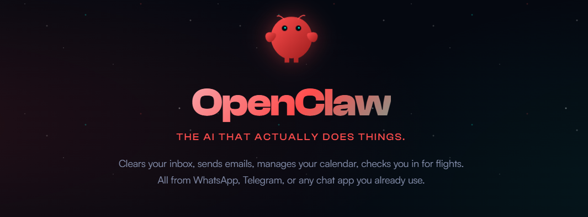

# OpenClaw帮你做的投研，恰恰是投资里最不值钱的东西

> 原文链接: https://mp.weixin.qq.com/s/KKKcDLkyc21MI7TqdetuDQ
> 图片状态: 已本地化 (assets/)

---

__图文 | 躺姐__

最近一个月，OpenClaw的热度席卷中文互联网，找我聊龙虾的人突然变多了。不是随便聊聊，是正经问——有人问怎么部署Stock-Analysis Skill，有人问能不能让龙虾自动盯盘，还有人直接甩来一份Agent生成的研报问我“这个逻辑有没有问题”。没用上或者不会用龙虾的焦虑，已经蔓延到了投资圈。

焦虑到什么程度？闲鱼上有人把GitHub免费的投资Skill打包标价5万块，页面显示卖了4单。那个被传烂了的神话更夸张：50美元启动资金，48小时变2980美元，收益率5860%，其实这只是Polymarket预测市场的统计套利，跟大部分人理解的AI炒股根本不是一回事，但这不妨碍它被当成AI自动赚钱的标杆到处传。

可你身边真有人用OpenClaw炒股赚到了钱吗？至少在我的圈子里，没有。就算把范围扩大到所有现在能用的AI工具，也很少有真正用它们做投资决策赚到大钱的例子。这种错过龙虾就等于错过时代的焦虑，既不理性，也不现实。

当然，我也知道有很大一部分人安装龙虾，其实并不是为了直接让它炒股，而是让它辅助决策。例如，每天收集一些关键公司的新闻做简报；再例如，在财报季分析上市公司公告，自动整理成成熟的投研报告等等。相信你也在很多投资群里看到了AI整理的研报材料，看上去结构清晰，自带一套看上去完美无瑕的方法论，和华尔街的顶级机构分析别无二致。

那既然AI代替人类交易暂时还不够靠谱，但至少做做研究分析总行吧？

可这恰恰就是我想着重说的事情，问题不在于AI能不能替你赚钱，问题在于它做出来的分析本身——AI能给你的最好的东西，恰恰是投资里最不值钱的东西：共识。用共识来快速了解一个陌生公司，当然可以；但真正的Alpha从来都来自“非共识”，这是AI给不了你的。

  

**** _01_ ****AI的认知盲区

用AI做基本面分析，确实很强。

给龙虾装上Stock-Analysis的Skill，扔一句“筛选白酒行业中短线潜力股，市盈率低于30倍，近30日资金净流入，业绩预告增长20%以上”，它几分钟吐出三只标的，附带市盈率、资金流向、业绩预告数据、投资逻辑，条理比大部分实习研究员写的东西都清楚。以前一个人做几天的活儿，Agent几分钟跑完，这是真实的效率跃迁，没什么可否认的。

澎湃新闻就采访过一个产品经理，在龙虾里养了一支投资智囊团，让几个Agent互相讨论投资标的。他觉得这套流程确实拓宽了视野，效率也实实在在提升了，说的一句话也很有代表性：“我抛出一个目的，看这群Agent互相讨论，甚至产生我没想到的问题”。

但你仔细想一下，所有这些分析、讨论、碰撞，有一个共同的前提：它们处理的全是已经数字化、已经公开的信息。财报是公开的，资金流向是公开的，舆情是公开的，行业对比数据是公开的。AI把这些公开信息的处理效率拉到了极致——但效率再高，不能改变信息本身的属性或价值等级。

华尔街几十年前就想明白了一件事：所有你能从公开渠道拿到的信息，已经反映在这家公司的股价里了，金融学管这个叫半强有效市场，说白了就是公开信息不产生超额收益。AI让你处理公开信息的速度从三天变成了三分钟，但这些信息并没有因为效率提升而产生更大的价值；更何况那些机构早就把更先进的工具嵌进决策流程了，公开信息只会被更快、更充分地定价。

前几天我刚从美国飞回来，机票是通过票代订的，拿到了全网最低价八折以内的价格。我当然知道AI能做比价，携程、飞猪、Google Flights本质上都在做这件事，搜索全网公开票价，按价格排序，这是AI最擅长的工作。但票代那边，有专门的机票价格询问系统，能够通过经年累月积累的经验帮你组合全网存在的最优航班路线，再找到最合适的货币汇率。

公开渠道和票代之间的价差，来自人的经验、认知和人脉关系，不在任何公开或半公开的数据库里，AI甚至连入口都找不到。如果你让龙虾帮你买机票，它大概率会搜遍全网给你一个来自携程或是飞猪的“最低价”，然后信心十足地告诉你这就是最优解。

它不会告诉你还有一层价格体系的存在，因为它根本不知道。

拉回投资领域，道理一模一样。管理层在业绩电话会上回答分析师提问时的语气变化、供应链上下游从业者对订单趋势的真实体感、行业会议茶歇时私下流传的判断，甚至你自己去逛超市觉察到的消费趋势变迁——这些在公开数据库中难得见到的内容，才是决定股价方向的关键变量。

更重要的是，你之所以能意识到这些盲区信息的存在，是因为你本来就对一个行业有着分析方法论。长期跟踪白酒，才知道AI的白酒分析里缺了渠道库存的体感；做过消费品投资，才知道在真实世界里的消费趋势往往都是从末端开始的。换一个你不熟悉的行业，AI给你一份同样完整的分析报告，图表漂亮，逻辑通顺，你有能力想到它缺了什么吗？

我自己就有这种体验。让AI跑一份我不熟悉的行业分析，出来的报告我从头看到尾，觉得每一步都有道理，找不到任何可以质疑的地方；可这不是因为报告真的没有问题，是因为我没有足够的积累去发现问题。这种“挑不出毛病”的感觉，其实是最危险的。

很遗憾，除非是专职炒股、对大部分行业都有深入研究习惯的人，几乎没人能有全知的视野。在你不熟悉的领域，AI给你带来的顶多就是个面上的“知道”；但拿着AI生成的完整报告，你会觉得你也懂了，然后就会基于这种“懂了”去做仓位决策。

  

**** _02_ ****越是完整，越是陷阱

基本面的盲区好歹还能让人心存警惕，你知道有些信息你拿不到，你知道报告不可能面面俱到。但技术面呢？

技术分析处理的就是K线和量价数据，这些数据本身是完整的，不存在信息缺失的问题，让AI做技术分析，每一个计算都有据可查，每一个指标都是数学公式跑出来的。MACD金叉就是金叉，RSI超买就是超买，布林线开口就是开口。你会觉得，基本面可能有盲区，但技术分析纯粹是数字游戏，AI应该没有盲区才对。

在这方面，龙虾的能力确实让人印象深刻：自动识别头肩顶、双底、三角形整理，计算各种技术指标的交叉信号，标注支撑位阻力位，跑历史回测，最后生成一份图文并茂的技术分析报告。每一步都对，每一个数字都有数据支撑，结论清晰，图表漂亮。比起基本面分析那种“你知道它可能缺了什么”的不安感，技术分析报告给人的感觉是这东西是完备的。

但完备和正确之间，隔着一道深渊。

龙龙虾能识别出教科书级别的放量突破，所有指标共振指向买入，但它不知道放量是大股东解禁前主力对倒拉出来的。它能识别出标准的头肩顶形态，指标确认，结论指向卖出，但同一个头肩顶在牛市末期是反转信号，在强势回调中可能只是洗盘。K线图上长得一模一样，含义完全相反。

这些例子，做过几年交易的人多少都听说过；但我想说的不是"技术分析有局限"，而是技术面这种错误在AI的包装下，变得几乎不可能被发现。

基本面的盲区，你好歹能感觉到空白的存在。你知道管理层的真实想法你不知道，你知道渠道端的体感你拿不到，这种"我知道我缺了什么"的意识本身就是一种保护。但技术面不一样，AI给你的图表从数据层面完美无缺，没有空白，没有缺失。错误不藏在数据里，藏在对数据的"解读"里，而解读需要的是对市场当下情绪、资金结构、板块轮动节奏的综合判断，这些"语境"根本不编码在K线数据中。

OpenClaw投资社区里的用户自己总结过一句话：“2月有效的策略，3月可能完全失效。”这不是策略的代码写错了，不是回测有bug，是市场的语境变了；真实世界里的流动性在变，情绪在变，资金偏好在变，政策预期在变。AI回测用的是历史数据，但历史数据里不包含“当下市场正在发生什么变化”这个维度。

策略失效不是技术问题，是这个游戏的底层规则：过去发生过不等于未来会发生。而技术分析本身，就建立在“过去的模式会重现”这个假设上。

更危险的是，很多人用AI做投研，恰恰是基本面和技术面一起跑的：先让它出一份基本面分析，再出一份技术面分析，两份报告结论一致，信心就上来了。但基本面那份报告缺了你看不见的信息层，技术面这份报告缺了你看不见的市场语境。

如果说基本面分析的盲区是“地图上少了几条路”，你好歹能看到空白，心里有数；那技术分析的盲区就是“地图上路都画全了，但没人告诉你哪条路今天封了”。两份报告各自的盲区你都没能察觉，叠在一起反而产生了一种交叉验证的错觉：你看着一份完整的地图满怀信心地出发，直到撞上路障才知道走错了。

  

**** _03_ ****结语

AI投研到底改变了什么？

它确实抹平了一条旧的鸿沟，以前散户和机构之间最大的差距是工具——你没有Bloomberg，没有Wind，没有量化团队帮你跑因子模型。现在龙虾装上几个Skill，散户也能几分钟生成一份格式规范、数据翔实的投研报告。

但它同时制造了一条新的鸿沟，旧的信息不对称是散户没有机构的工具和数据，散户知道自己弱势，“我知道我不懂”这个认知本身就是保护机制，面对不了解的股票，你会谨慎，仓位会轻，止损会快。而新的信息不对称是理解AI输出边界的人和不理解的人之间的差距，靠着AI带来“完整分析”的人，conviction（信念感）比以前更强，仓位比以前更重，止损也比以前更慢。

AI是极好的效率工具，该用就用，但你要清楚它在帮你做什么：它在高效地帮你获取共识。共识不是没有价值，但共识在投资里恰恰是最不稀缺的东西。龙虾能够给你画了一张前所未有的详尽地图，但走哪条路、什么时候出发，地图不会替你决定。

**声明：本文仅用于学习和交流，不构成投资建议。******欢迎** 点赞、在看、转发**，您的支持是我们更新的动力！****** _关联阅读：_**** _[没有人看好美股，但所有人的钱都在买入](<https://mp.weixin.qq.com/s?__biz=Mzg5NTg1Mzg3NQ==&mid=2247487094&idx=1&sn=7a2420e434de49a59ce488dc8f469577&scene=21#wechat_redirect>)_**[ 百度的春节红包，和别家不太一样](<https://mp.weixin.qq.com/s?__biz=Mzg5NTg1Mzg3NQ==&mid=2247487089&idx=1&sn=ea849ef6e4f8d1cdb450749705bfaca2&scene=21#wechat_redirect>)[被低估的科大讯飞：赚钱的AI公司，反而更便宜？](<https://mp.weixin.qq.com/s?__biz=Mzg5NTg1Mzg3NQ==&mid=2247487080&idx=1&sn=3baa74232e70f5d7a360fdc67bc896ec&scene=21#wechat_redirect>)** _[贵金属闪崩启示录：不要假装自己在“分散投资”](<https://mp.weixin.qq.com/s?__biz=Mzg5NTg1Mzg3NQ==&mid=2247487076&idx=1&sn=cbc8a4e5a7a7fb21b54f2dc692c03675&scene=21#wechat_redirect>)_**** _[巨头财报夜：Meta狂砸1350亿，微软增速失守，马斯克砍掉高端车](<https://mp.weixin.qq.com/s?__biz=Mzg5NTg1Mzg3NQ==&mid=2247487070&idx=1&sn=3798c0193d0232bf5ae07e54270eff84&scene=21#wechat_redirect>)_**** _[OpenAI的商业迷思：订阅制不是大模型的答案](<https://mp.weixin.qq.com/s?__biz=Mzg5NTg1Mzg3NQ==&mid=2247487064&idx=1&sn=9c068f47d2d722f54fb33976214ef2dc&scene=21#wechat_redirect>)_**** _[智能手机大变局：苹果向谷歌低头，豆包被生态围剿](<https://mp.weixin.qq.com/s?__biz=Mzg5NTg1Mzg3NQ==&mid=2247487059&idx=1&sn=5098375a49bccbfe178a18cae33e4596&scene=21#wechat_redirect>)_**** _[电力系统：中国制造的隐藏成本线](<https://mp.weixin.qq.com/s?__biz=Mzg5NTg1Mzg3NQ==&mid=2247487053&idx=1&sn=8092679dc878f206d6978e6fdd9b6e62&scene=21#wechat_redirect>)_**
