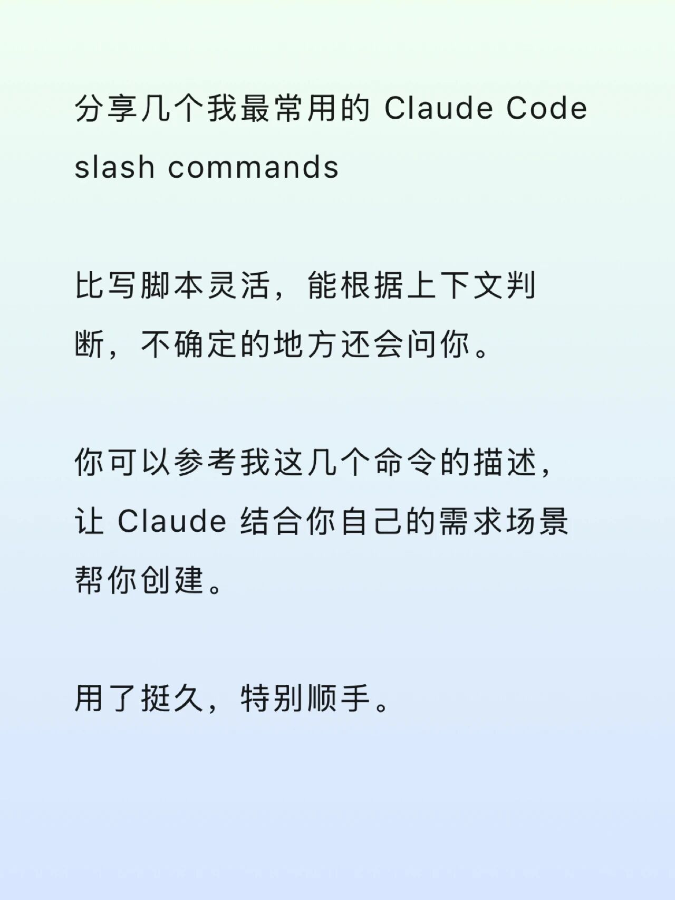

# 分享几个我最常用的 Claude Code slash commands

> 原文链接: https://mp.weixin.qq.com/s/60pamTAvxziVYrWMmWbrxA
> 图片状态: 已本地化 (assets/)

---

日常开发绑定最多的操作就是 commit、PR、release 这些。操作本身不复杂，但细节挺烦人。  
  
commit message 格式要统一 ，PR 要写测试用例，Release Notes 要分类整理。  
  
后来就给 Claude Code 配了几个自定义技能，现在都是一个命令搞定。  
  
\---  
  
/git-commit  
  
不用想 commit message 怎么写了。它会看 diff，直接生成符合规范的消息。  
  
/git-create-pr  
  
这个用得最多。一个命令完成 commit、push、创建 PR。PR 描述会自动带上 Summary、测试用例表格、回归测试清单。  
  
测试用例也不是无脑生成，纯文档或配置改动会跳过。  
  
/create-issue  
  
和 Claude 讨论完一个问题，直接 /create-issue，它会从对话里提取背景、方案、任务列表，生成结构化的 Issue。  
  
以前经常聊完就忘了记或者存到文档中产生许多临时文档，现在不会了。  
  
/release-mobile 和 /release-desktop  
  
我的项目是 monorepo，移动端和桌面端分开发布。这两个命令会自动过滤不相关的 commit，生成分类好的 Release Notes ，然后创建 GitHub Release。  
  
桌面端还会自动拼好各平台的下载链接。  
  
\---  
  
比写脚本灵活，能根据上下文判断，不确定的地方还会问你。  
  
你可以参考我这几个命令的描述，让 Claude 结合你自己的需求场景帮你创建。  
  
用了挺久，特别顺手。

  

