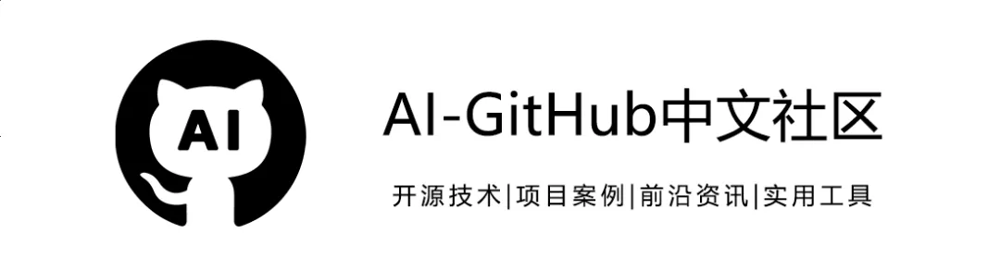
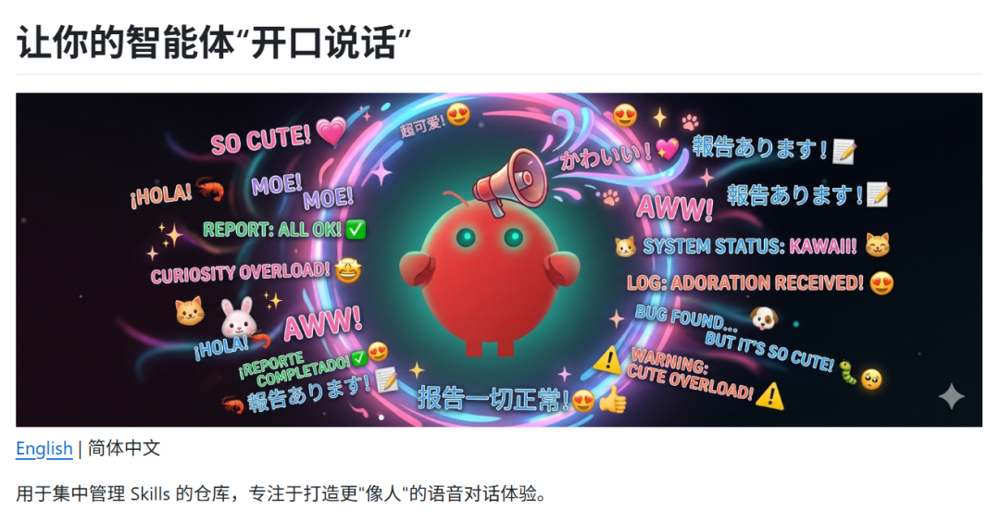
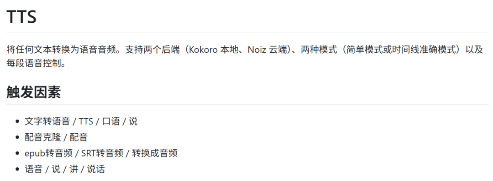
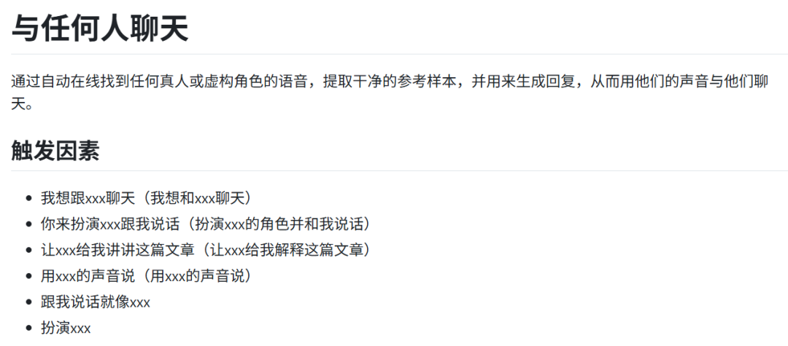
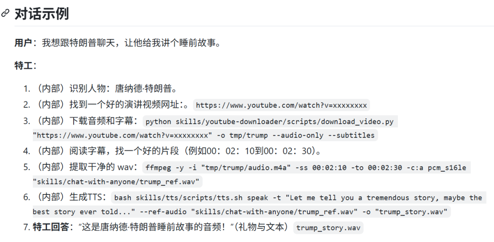
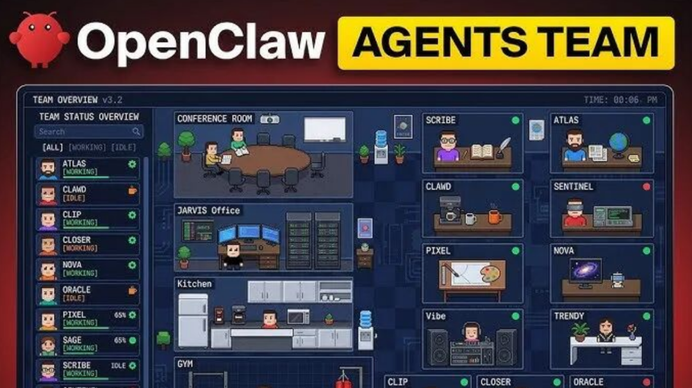
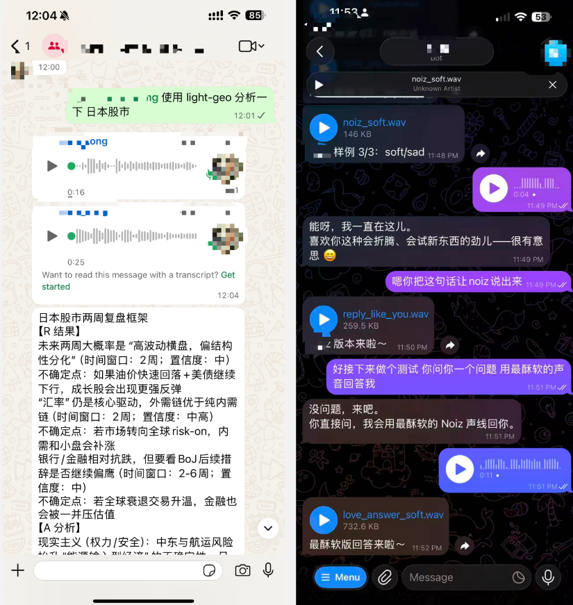
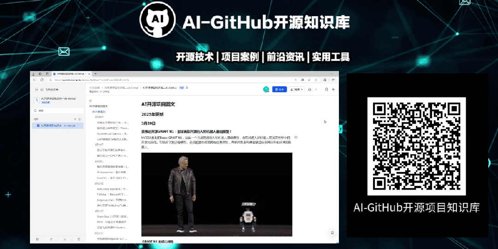

# 让 OpenClaw 小龙虾开口说话！开源 NoizAI Skill： 一键给小龙虾装上声音 + 音色克隆。

> 原文链接: https://mp.weixin.qq.com/s/p0Zvgc2bFcOBvp3A6V4gig
> 图片状态: 已本地化 (assets/)

---

近期，专注于AI语音的Noiz AI 平台开源了全新技能仓库**NoizAI/skills。**

它让AI 助手（如 OpenClaw 小龙虾）能够开口说话，甚至克隆任何人的音色，从而为AI交互带来前所未有的陪伴感和人格化体验。

该项目旨在将高级音视频处理能力转化为开发者可调用的原子化技能，使 AI 机器人不再仅仅是文字聊天框，而是能用人声交流的情感助手。

  

##### **功能特点**

  

NoizAI/skills 提供了5个核心技能，几乎涵盖了 AI Agent 与语音结合的所有关键场景：

**文本转语音（****TTS****）**

支持 Kokoro（本地）和 Noiz（云端）两种后端。提供简单模式、时间轴精确渲染、精确时长控制，并支持通过参考音频进行音色克隆。

**用目标人物的声音进行对话**

可自动在线寻找目标人物（真实或虚构角色）的语音，提取干净参考样本，并用其音色生成语音回复，实现与任何人对话的体验。

**特色语音（Characteristic Voice）**

通过语气词（如 hmm、haha、aww）、情绪参数和场景预设（晚安、早安、安慰、庆祝等），让生成的语音更具人味和陪伴感。

**视频翻译**

将视频中的语音翻译成另一种语言，用 TTS 生成配音并替换原始音轨，同时保留视频画面，实现跨语言视频内容的快速本地化。

**技能管理与扩展**

提供完整的命令行工具，支持从 GitHub 仓库查看、安装、调试技能，便于开发者快速集成与二次开发。

  

核心亮点

  

**安全且本地优先**  

技能可在用户自己的机器上运行，敏感文本和资源无需上传云端，保障隐私与数据安全。

**人格化语音控制**  

通过微调语气词、情绪参数和场景预设，让语音输出富有情感和个性，打造真正有陪伴感的 AI 助手。

  

应用场景

  

**多角色协同工作**

在 Agent Teams 中，为不同角色（运营、客服、代码助手）配置不同音色，用户无需看屏幕，仅凭声音即可辨识当前对话的 AI，提升多任务处理效率。

**无障碍交互场景**

在开车、做家务等不便观看屏幕的场景下，AI 助手通过语音传递信息与人设，实现纯听觉的高效交互。

**AI助手人格化**

为 OpenClaw 等 AI 助手赋予独特音色，使其在心理层面更真实，极大增强互动趣味性。

**内容创作与本地化**

视频翻译技能可快速为外语视频生成母语配音，保留原画面；音色克隆功能则能为虚拟主播、有声内容提供定制化语音解决方案。

**情感陪伴与娱乐**

通过特色语音技能调节情绪参数，让 AI 在晚安、安慰、庆祝等场景下给出更具温度的回应，成为用户的情感陪伴伙伴。

NoizAI的skills 通过开源、模块化方式，将专业的语音 AI 能力走向大众，让每个开发者都能轻松为AI 助手注入声音与灵魂。

无论是提升产品交互体验，还是探索 AI 人格化的新可能，这个项目都提供了一个极具潜力的起点。

  * 

    
    
    GitHub：https://github.com/NoizAI/skills

**欢迎扫码加入社群**

**一起交流AI前沿技术！**

**  
**

**小编免费共享AI开源项目知识库，**

****实现大家的AI资讯自由！****

****直接扫码或点击链接即可查看！****

****  
****

AI开源项目知识库：https://qyxznlkmwx.feishu.cn/wiki/BwWIwsCOuiMWGmkUzNHcKLvPnPh

****

点击下方名片「**关注我们** 」第一时间收到推送  

